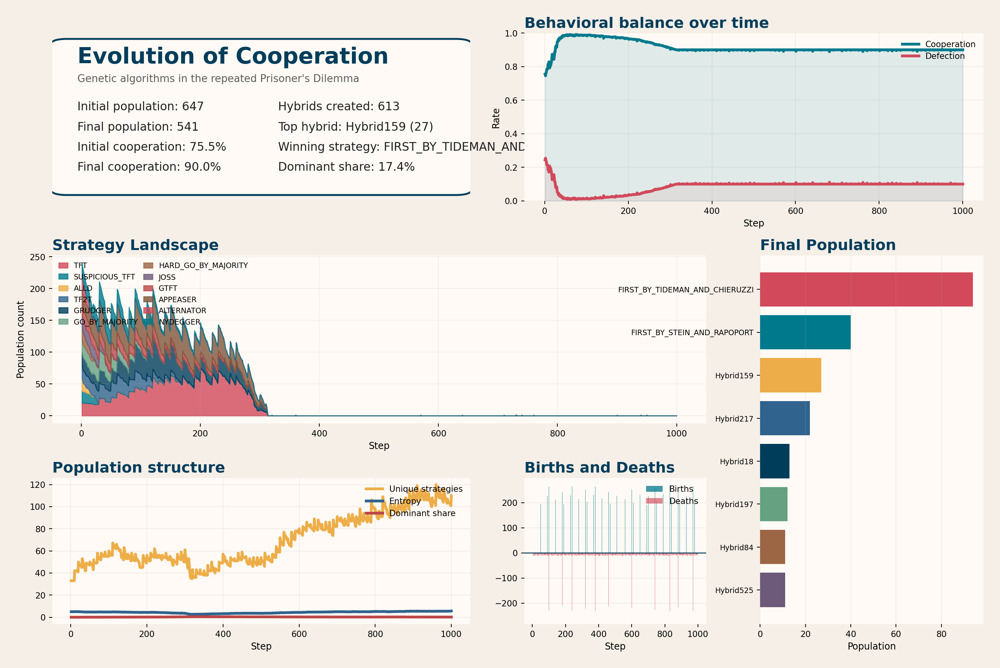

# Evolution of Cooperation via Genetic Algorithms

Python simulation of evolving populations in the iterated Prisoner's Dilemma using an explicit individual-agent model. Each agent carries validated bit-array DNA, plays one opponent per step, accumulates score, faces score-based elimination, and reproduces on a configurable schedule.

Important constraint:

- the simulation only uses strategies that can be encoded exactly by the implemented DNA families
- strategies marked `approximate` or `unsupported` in the Axelrod mapping are documented for comparison, but they are not used as evolving seeded strategies unless they are later implemented exactly

Action encoding follows the project spec:

- `1 = Cooperate`
- `0 = Defect`

## Structure

- `cooperation_ga/`: simulation package
- `main.py`: CLI entrypoint
- `sample_config.json`: example simulation configuration
- `sample_render_config.json`: example visualization configuration
- `docs/example_runs.md`: concrete example runs and saved rendered outputs
- `tests/`: unit and behavioral tests

## Requirements

- Python 3.10+ acceptable
- Python 3.11+ preferred
- runtime dependencies are listed in `requirements.txt`
- reference-verification test dependencies are listed in `requirements-dev.txt`

## Usage

Run the sample experiment:

```bash
.venv/bin/python main.py --config sample_config.json
```

Copy the bundled example configs into a local folder:

```bash
.venv/bin/python main.py --copy-example-configs ./example_configs
```

Render a static infographic from saved metrics with a separate visualization config:

```bash
.venv/bin/python main.py --render-config sample_render_config.json --render-from-metrics sample_output/metrics.json
```

Run with per-step progress output:

```bash
.venv/bin/python main.py --config sample_config.json --verbose
```

Run with detailed plain-text debug logging:

```bash
.venv/bin/python main.py --config sample_config.json --debug
```

Run with trace-level plain-text event logging:

```bash
.venv/bin/python main.py --config sample_config.json --trace
```

During long runs, the CLI prints an explicit message when the simulation loop has finished and the program is writing results to disk. That export phase can take noticeable time on large runs, so this message confirms the process is still active and has not hung.

## Single-File Release

End-user binary instructions are kept in the GitHub release notes so the main README stays shorter:

- [v0.1.0 release notes](https://github.com/nikiigo/asga/releases/tag/v0.1.0)

For maintainers, the local packaging command is:

```bash
./build_release.sh
```

## Example Run

The repository includes a saved example for the 1000-step full-strategy run:

- walkthrough: [docs/example_runs.md](docs/example_runs.md)
- HTML report: [docs/examples/report_1000_steps_all_strategies_20.html](docs/examples/report_1000_steps_all_strategies_20.html)

Preview:



Run tests with the standard library runner:

```bash
.venv/bin/python -m unittest discover -s tests -v
```

If you want to run the Axelrod reference-verification tests, install the development dependency too:

```bash
.venv/bin/pip install -r requirements-dev.txt
```

## Implemented Features

- Hashable typed bit-array DNA strategies with mutation, one-point crossover, validation, and random generation
- Family-aware DNA execution supporting `LOOKUP`, `TRIGGER`, `COUNT_BASED`, `PROBABILISTIC_LOOKUP`, `FSM`, `SCRIPTED`, `COUNTER_TRIGGER`, and `NN`
- 51 implemented baseline DNA strategies across the supported families, including 38 exact Axelrod-mapped strategies and project-local helper baselines
- Seeded-default initialization with 15 predefined DNA strategies and 50 agents per strategy in `sample_config.json`
- Explicit `initial_population` mapping support for baseline names and DNA strings
- Repeated Prisoner's Dilemma match simulation with configurable payoffs, configurable `rounds_per_match`, and optional action noise
- Explicit individual-agent population with unique ids, scores, and ages
- Random pair matching without replacement so each agent plays at most one match per step
- Bottom `death_rate` score-based death each step, defaulting to 2%
- Step-based lifecycle with reproduction every `reproduction_interval` steps
- Individual-based parent selection weighted by adjusted score
- Pair-based reproduction with one child per parent pair by default
- Parents remain alive until they have produced `max_children_per_agent` children, then die
- Mutation interpreted as expected mutated genes per offspring genome
- Configurable maximum population cap with overflow culling blended between random removal and low-score pressure
- Per-step metrics with CSV and JSON export, including `DNA -> count`, dominant DNA, dominant group size, and dominant share
- Static infographic rendering from saved metrics
- Seeded initialization using deterministic baseline DNA plus random DNA

## Baseline Configuration

`sample_config.json` includes a seeded setup with:

- `seed_strategies`
- `seed_strategy_population`
- `rounds_per_match = 20`
- `max_population_size = 500`
- `overflow_cull_rate = 0.3`
- `overflow_cull_score_correlation = 0.5`

Some deterministic baselines still have a simple decoded action-table view:

- `ALLC -> CCCCC`
- `ALLD -> DDDDD`
- `TFT -> CCDCD`
- `PAVLOV -> CCDDC`

For this memory-1 shorthand, the symbol order is:

- `[initial, CC, CD, DC, DD]`

So in `TFT -> CCDCD`:

- first `C` = initial move
- second `C` = move after `CC`
- third `D` = move after `CD`
- fourth `C` = move after `DC`
- fifth `D` = move after `DD`

Internally, DNA now uses a typed header plus family-specific payload:

- `VERSION | FAMILY | PAYLOAD_LENGTH | PAYLOAD`

## DNA Structure

Every genome is stored as a raw bit string. The common header is:

| Field | Bits | Meaning |
| --- | --- | --- |
| `VERSION` | 3 | DNA format version |
| `FAMILY` | 5 | Strategy family identifier |
| `PAYLOAD_LENGTH` | 16 | Length of the family-specific payload |
| `PAYLOAD` | variable | Parameters for the selected strategy family |

Implemented DNA families and payload meaning:

| Family | Purpose | Payload summary |
| --- | --- | --- |
| `LOOKUP` | History table with optional random action genes | initial action, memory depth, random-action probability, action table |
| `TRIGGER` | Binary trigger strategies | initial/default/triggered actions, trigger states, forgiveness, random-action probability |
| `COUNT_BASED` | Majority/count thresholds | initial action, window, threshold, mode, random-action probability |
| `PROBABILISTIC_LOOKUP` | Stochastic memory-k strategies | initial probability, memory depth, probability table |
| `FSM` | Finite state machines | initial action, state count, initial state, random-action probability, transitions |
| `SCRIPTED` | Exact named algorithms | script id plus family-specific parameters |
| `COUNTER_TRIGGER` | Escalating punishment rules | trigger states, punishment-length parameters, random-action probability |
| `NN` | Feed-forward neural strategies | feature count, hidden size, encoded weights and biases |

Implemented DNA families:

- `LOOKUP`
- `TRIGGER`
- `COUNT_BASED`
- `PROBABILISTIC_LOOKUP`
- `FSM`
- `SCRIPTED`
- `COUNTER_TRIGGER`
- `NN`

The exported `dna` field is the raw bit string. When a DNA matches a known baseline, exports also include the corresponding `strategy_name`.

Action-gene note:

- `RANDOM` is a real gene, not a hardcoded 50/50 fallback
- in `LOOKUP`, `TRIGGER`, `COUNT_BASED`, `FSM`, and `COUNTER_TRIGGER`, the genome carries a family-level random-action probability used whenever an action gene is `RANDOM`
- `PROBABILISTIC_LOOKUP` already stores explicit probabilities per state

### What A Gene Means In Each Family

Mutation works on raw bits, but the behavior-changing "gene" depends on the DNA family. In practice, a mutation or crossover event can change these properties:

| Family | Genes / mutable properties |
| --- | --- |
| `LOOKUP` | initial action, memory depth, family-level random-action probability, each lookup-table action entry |
| `TRIGGER` | initial action, default action, triggered action, trigger states, forgiveness probability, family-level random-action probability |
| `COUNT_BASED` | initial action, lookback window, threshold, comparison mode, threshold decision direction, family-level random-action probability |
| `PROBABILISTIC_LOOKUP` | initial cooperation probability, memory depth, per-state cooperation probabilities |
| `FSM` | initial action, number of states, initial state, family-level random-action probability, every transition's next state and emitted action |
| `SCRIPTED` | script id and any script-specific parameters encoded in the payload |
| `COUNTER_TRIGGER` | initial/default/triggered actions, trigger states, punishment length, escalation flags, recovery flags, family-level random-action probability |
| `NN` | feature count, hidden size, every encoded weight, every encoded bias |

So a child can differ from its parents by a changed rule-table entry, a different threshold, a different FSM transition, a different scripted strategy id, or a changed neural weight, depending on the family.

## How Children Are Formed

Children are created from raw bit-array DNA, but the outcome depends on whether the parent genomes are structurally compatible.

Current crossover order:

1. if both parents have the same total bit length, try one-point crossover on the full bitstring
2. if that fails, and both parents have the same DNA family and the same payload length, mix payload bits 50/50
3. if that also fails, inherit one whole parent genome unchanged
4. apply mutation to the resulting child
5. if the mutated child is invalid, retry until a valid DNA is produced

That means the child DNA is always one of these:

- a true mixed hybrid bitstring
- a same-family payload mix
- a copied parent genome
- any of the above plus mutation

### Worked Example

Same-family deterministic lookup parents:

- `TFT` = `CCDCD` = `00100000000000000001010000011000000000010001`
- `PAVLOV` = `CCDDC` = `00100000000000000001010000011000000000010100`

One valid child produced from those parents is:

- `CCDDD` = `00100000000000000001010000011000000000010101`

Human meaning of that child:

- first move: cooperate
- after `CC`: cooperate
- after `CD`: defect
- after `DC`: defect
- after `DD`: defect

So the child keeps part of the `TFT` behavior and part of the `PAVLOV` behavior, but it is neither parent exactly.

### Same-Family vs Cross-Family Pairs

- `LOOKUP x LOOKUP`, `FSM x FSM`, `TRIGGER x TRIGGER`, `COUNT_BASED x COUNT_BASED`, and other same-shape pairs can often produce true mixed children
- cross-family pairs such as `TFT x NYDEGGER` usually do not produce rich hybrids directly, because mixing incompatible headers and payloads often creates invalid DNA
- in those cross-family cases, the engine usually falls back to inheriting one parent genome and then relies on mutation to create novelty

So in practice:

- same compatible family: children are often real hybrids
- different family: children are usually parent-like first, then potentially changed by mutation

## Strategy To DNA

The simulator uses only strategies that have an exact DNA encoding. The table below shows the current exact strategy set and how each one is encoded.

Note:

- `GTFT` matches the Axelrod reference exactly for the default payoff matrix `(R=3, P=1, S=0, T=5)`
- if you change the payoff matrix, Axelrod's reference `GTFT` would recompute its generosity parameter from the game, while this simulator keeps the encoded default-payoff value

| Strategy | DNA family | Raw DNA |
| --- | --- | --- |
| `ALLC` | `LOOKUP`, shorthand `CCCCC` | `00100000000000000001010000011000000000000000` |
| `ALLD` | `LOOKUP`, shorthand `DDDDD` | `00100000000000000001010001011000000001010101` |
| `TFT` | `LOOKUP`, shorthand `CCDCD` | `00100000000000000001010000011000000000010001` |
| `SUSPICIOUS_TFT` | `LOOKUP`, shorthand `DCDCD` | `00100000000000000001010001011000000000010001` |
| `TF2T` | `LOOKUP`, memory depth `2` | `00100000000000000010110000101000000000000000000100010000000000010001` |
| `PAVLOV` | `LOOKUP`, shorthand `CCDDC` | `00100000000000000001010000011000000000010100` |
| `JOSS` | `PROBABILISTIC_LOOKUP`, memory depth `1` | `001000110000000000101010111111110111100110000000001110011000000000` |
| `GTFT` | `PROBABILISTIC_LOOKUP`, memory depth `1` | `001000110000000000101010111111110111111111010101011111111101010101` |
| `RANDOM` | `PROBABILISTIC_LOOKUP`, constant `p(C)=0.5` | `001000110000000000101010100000000110000000100000001000000010000000` |
| `GRUDGER` | `TRIGGER` | `00100001000000000001101000000101010000000010000000` |
| `NYDEGGER` | `SCRIPTED[NYDEGGER]` | `00100101000000000010000000000000000000000000000000000000` |
| `SHUBIK` | `SCRIPTED[SHUBIK]` | `00100101000000000010000000000001000000000000000000000000` |
| `CHAMPION` | `SCRIPTED[CHAMPION]` | `00100101000000000010000000000010000000000000000000000000` |
| `TULLOCK` | `SCRIPTED[TULLOCK]` | `00100101000000000010000000000011000000000000000000000000` |
| `PROBER` | `SCRIPTED[PROBER]` | `00100101000000000010000000000101000000000000000000000000` |
| `ADAPTIVE` | `SCRIPTED[ADAPTIVE]` | `00100101000000000010000000000110000000000000000000000000` |
| `APAVLOV2006` | `SCRIPTED[APAVLOV2006]` | `00100101000000000010000000000111000000000000000000000000` |
| `APAVLOV2011` | `SCRIPTED[APAVLOV2011]` | `00100101000000000010000000001000000000000000000000000000` |
| `SECOND_BY_GROFMAN` | `SCRIPTED[SECOND_BY_GROFMAN]` | `00100101000000000010000000001001000000000000000000000000` |
| `ADAPTOR_BRIEF` | `SCRIPTED[ADAPTOR_BRIEF]` | `00100101000000000010000000001010000000000000000000000000` |
| `ADAPTOR_LONG` | `SCRIPTED[ADAPTOR_LONG]` | `00100101000000000010000000001011000000000000000000000000` |
| `FIRST_BY_STEIN_AND_RAPOPORT` | `SCRIPTED[FIRST_BY_STEIN_AND_RAPOPORT]` | `00100101000000000010000000001100000000000000000000000000` |
| `FIRST_BY_TIDEMAN_AND_CHIERUZZI` | `SCRIPTED[FIRST_BY_TIDEMAN_AND_CHIERUZZI]` | `00100101000000000010000000001101000000000000000000000000` |
| `EVOLVED_ANN` | `NN` | `001001110001011111010000000100010000101001000000010111010110111011111110010000000000100001110000000100110100000101010010110111111110101011000000110001100010010111000000101111101011110111100010010010101011111011000111100000011101111010111110110001011111000110111101101111110001100000110110001100000100000100001010100001000011010010111110101000011011010001101101110000010100110001011100101101101100000001101110001110000101111000111111010001010010000011001001110000100000010000011010101100001011111100101101001110000110100010111111011011101001000101110110110000010100001101101110011010111011111100110011010110100011000110111111011011001100010001010000101111101001110010001011111001101011111100110000001011111111110100111110111111000010010000110011001111101101010100011010011110110100000000001111000010010011100111000000100110101000001110010011101111111111100111000011101000000100000101110011110000010010011101000001010100110011011111111100010000000000100000111100001011100100000000111011001001001010101010111111010000010011010100011110001111111001100110000011001001000011110110001010011100100000001000111111010010001000010111110100110000110011000101111111110101000100000011011100101000111110010110111101101010011010101101100110101111110100110010111010110000101100000100000011010100101011000101000001100010111001101100101100110000011001110001011101100110100100000110111100100100001001000101000000111011100011000011011001110000001000100001100011010110000100001001001111001010001110010010111111011101011010001111000111101111000111110000011010010110111011111111011001100011110101100100111111000010000101110000011111101111110101111001111011000110101011111100111111011101001000000110111110010010111101100000001100001111110011110011010101010101110100000110011101100010011010101011000000001110101110110101111111101111101001001101010000101110111100000010101011001111011101011100111111100101100000110001100101001111111011000111110100101010010011111011000110111010000101011011000000101101110101101010110101110000001001010010001001110100000011111100010001101101010110110100111110100111100011110001011100110000010000110111000001110000101100000010010111011100110110011100111111011000100001010000011100101111110111001110111100010001101011111100001001000110011010000111000001101100000100110110000101101111110111010110101101010011100011111000100000000100100110100011000001110001011010111101101101010000011010100000000100000000101100000011000011001100010000000010111111011100010101001101000011101111110011100000101110100101100100000001011111011010100010110000111110000011000110110110010001101111110111111011111110000100011011111001101111100100001001100000111111010011000010011011100000001111111000111100010101110111000011110011111101001100111110011000111110101111011110100111111100101111110100010101000101011011100011111010011111000011100101100110111011110010000100011000110000001111001001000110110011110110010011111100010001010110110000110010111101001100000010010010000100101111110101011001111101011010110011111011100111010011100001000100111100110101111110100011011100010000010000100011110100101110010100001001110000011010100010010011000001001100010000111010000110001111111111101000110110101110111011111110100000111011100111010011000000010010100000010010101111101111101100100111011111010010011100000011111111001111011110001111000001010011111010101010111011101111110110001111101101110100101011110100110100011010101000011011000101000011110010100111001111010000000100100010110110000001111100000010010111110100000011010100111111110001111001000001001111010000011011110010110111011001110100000001101100100100111000010011000010010001000001001111010111101111101001111110000011101001101100000101001110010010101110110001000000010101101100001010000010110001001000110010010011101111011100000100001001110010100101111011000000101011111101101100000110010000010001010100010010011100101011111101101101100110000001100000111111011111000111110000000000010000101000111101000101101001001100001000100111001001100010110110111101101101110001000000101010110000011100101111001110101010111011111111010000100110001001101001000000011011100010110100101001001111111010000101111101000101001100000000001010101010111101111100111111100001111100101011100100101111111100010001110110101110100011111100100110000110001111111111000001000110001101111110111110001111110111111110001100111111111100000001100101011110010010000101000000000101011101001110001110101111111000011110011001001111001100001000010000001000101010001101000010010001011001100111010010101111011100001111001010100000000100000110110010000111110110010011000100100100011110110100110100110001000100111011010101110101111011111010010000010001111001101011000001010010010101111101101111101111101111111001100111010110010100001010100010001101110111101100111111001110010001110000110000110000000110111001011001001000101011111101111001110011000110111111000010100010000000111011010001110000000000111101010110100010010011110110010000101101101100010110111111101000000001111000101011101111010100000000001100110010011011111101000100100111111101011101000001100011111000000000111101101111111000110100001101010010000011110110010111110001110001000001000000000000111001011111011111101111110110101010101011110000101100000111011010111001000110001011000000000110001101000100011111010000000000111010111001010001000100001111011111101110000010110100111110111001110001001000011101010000010010100101101010011000110011111111111110000100011011100111000100110001001100011010111011101111110011110010110110100001000011111101101000100110111011111010111111010010000110011110011001001111101010100011111011110110000011111111100111111111011011000111000000011001110000111010100000101111110111100101000001010000010011110111110111101010100001110001000000001111101111111110110110101111011110011011110101011111111011111100111110011101100001101011000000011101110101110000000101001111110111101001101011110110001100000010100001101101011111101001000000011001011011010000010110110000000111001011101111100010011100000000110110110111001000110110111110110101100001110011101110001111111011110000011010010001011011110011011011111111001111010010111100111001000111011110101100` |
| `EVOLVED_ANN5` | `NN` | `00100111000010111111000000010001000001011100000111100000110100100011001011000000101010001010010110100111101111111110011001001011111010001100000110011110111000100111010111000001110001001101011101001111010000000111010000111110000111100011110011000000010011000001000011000010010110100000001101001011010000010010000000001110011111111100000000010101011010100101010001000001100001011110100001010100001111101001111011000010111100011100001100101001010101011011110111000000101101110010110011100101001111110101101001000101010100001011111001100111011110011100111011000001100011101010111101100101101111110011010001010001011101101100000100100111110001101010111111000000010000111000010101101101101111110010111001011001100000001100010110001011001011100110000001000111000001000001001010001000110001100010100110000011001001101100001011101100001110111000011101000010101110100110000010101010110001100111101101001110100110101100000101011011100111000111101101000010010010000110101101110111110000001111001101010101101011000100001010110101100011000010011100111111110011000010101101101010010000000011000001011110101110001100011100011011001000110001110001000001111001110011110101000010101111101110000011000011110110100100000010111000100101000001111001000000101010010111000110101010110000000010001011111100000011011100100001101001001010111100110111000000011000110110000101010101110000001001111001111100110011100100010010001011011010001010000001000000100001011001011011100010110000010110101001100100010101101100000110111010000001101001010100111111000011001100111001011001110000011010010111011010101110100011111100010001110010000001100001000001000100100000010101111001010000000110010001000110011110110100010010100111001100011101101001000101111000100001101111010011010001111001000001000101000101011100010001010110010111000101101111000100011001110011110101100011110001010101101111101111011111001011111111110100000100011110001111000000110101000100010101000001110000010110100001010111011110001100010100110100010110011100101101000110101011111100100010000110110000000000100110101010111011101100010010001101100011111000000111001000100111001001110001011110010000101011111001010110101010001100010110110000110000011011101111000111001100000001111010100111110000011101110010000001101111101100000000100111010010011011111001000011101110011100100000100101110000111001011110110100010001110100000011011111011110011011101111000010001111000001111100001111110000100000001100110100011000010100001011010101001100101101111111000100101110100001010011110100110000101001100110000101110001100100001101100100111111000101011001000000010010101100001101001110010000001111101100011111000111001100000110001100110011011010001111000001001000101101000110101010110000000011100010110110011101101100000011000011100111001111100111000011101001111111001101100100010000100101000101011101110010000100010010011111000111101111101001000001101101110000110111010011010001000000010101001011110000101011111100101101000111011000010101000000100011010000000011010111010000001000010001111000011001000100001011111000001111100001100011000011000000000001000100111101` |
| `EVOLVED_ANN_NOISE05` | `NN` | `00100111000010111111000000010001000001010100000110111111000100101111100011000100111000110101100111111010110000101100011111111010001111111011110100100010010001000111111111000000110001101011100011000100010000000110110100100010100111101011111001101111110010110100011111000011001101010010001101111011010000010100001000100001011111101011111011111110010011101100111110111111100010011001011110111000010000010010101111111010011110001011111010010100010011110011010111000001100000011101000100100110101111111101101111100010001000000011110100000011111100110000001011000011000111100010101010101000110000010110101000101111111011000100000101110110100010011000111001000000101110110000100110101010010000001001001000100010101100110100000001010011001011110010100010111111111110111100011011001001010000010011101111111111010011010100000101011010111001011010010101000000110001110001011011111101110000001101001001110111100001101100000010101000111101111011100011000000011011010101011101001000001111110111111010100011110001101100000010011111000000101011110000111110101111011111001110000001110000001001010100111100011110100011111100010010111011100000011011000010110000100111110110010100110000011001011100110001000001110100000000110101100100001100101101000100101100100101011001001010110000100111011010100100100100111100001011000001111110000111111011000010000011110011111011011011010000011010110111111001111101001100011100101000110010001000000111000001111101110100110100001011010001000000101100110100101110111011111110011001111110101111010101000010101011011110100011101110110001100010010000011001001011001100000000000010111111000101110101000001101100010101100111110101110000110001101100000111011010001100000111100011010001011101000111000000010110010001001001100011110000010101110111101010001011000100000101011110101110000011010001000001001001000110101101100110001111110101111001100100100011110100000010101000110011000001110111000010110011110001111111100001110000010011011110011010100100110100000100000001100110111111011010111111000010010000101010000100110000010001000110111101011101110011111101010000110010101100001011000000111010000110100111001101101111110011110110000110001100111011111111011001111001111000000000111111100001110101100011111001110001010010101011000000011000111100000010101101111011000001001011000011001111000011111111011011001111101100000111111010101101011100001010000110000001100101001111000010111100100011110111001010110000101010011110110010000101100100001000110101001111010111111001000001001100010001111001000001110000110010100101011011100101010100000111111101011010000100011011000011100110111001100110110000010000100100010001011111110101011100000010111010001110111010101011000010101100010000110110001011110000111000111000011110001100000011111100110010111011100100011001000011000111001011111110000100001111111110011100111000011011000100000001011011000011111110111111000010111110111101110001011100110000011100100101011011000111010100001011100111111110000011011101000001101010100011101010001011001111101000110001111110001111010100000000111001100110001110000111000010010101111111000010110110` |
| `ALTERNATOR` | `FSM` | `001001000000000000100100000010001000000001001010010000000000` |
| `CYCLER_CCD` | `FSM` | `0010010000000000001011100001000010000000000010000101010010100000000000` |
| `CYCLER_CCCD` | `FSM` | `00100100000000000011100000011000100000000000100001000100001001011010110000000000` |
| `CYCLER_CCCCCD` | `SCRIPTED[CYCLER_CCCCCD]` | `00100101000000000010000000000100000000000000000000000000` |
| `APPEASER` | `FSM` | `001001000000000000100100000010001000000000000010010100100000` |
| `GO_BY_MAJORITY` | `COUNT_BASED` | `001000100000000000011110000000000010000000011010000000` |
| `HARD_GO_BY_MAJORITY` | `COUNT_BASED` | `001000100000000000011110010000000010000001011010000000` |
| `GO_BY_MAJORITY_5/10/20/40` | `COUNT_BASED` with explicit window | family variants with distinct raw DNA |
| `HARD_GO_BY_MAJORITY_5/10/20/40` | `COUNT_BASED` with explicit window | family variants with distinct raw DNA |

The default seeded strategy list is:

- `ALLC`
- `ALLD`
- `TFT`
- `TF2T` (`Tit For 2 Tats`)
- `PAVLOV`
- `JOSS`
- `GTFT`
- `NYDEGGER`
- `SHUBIK`
- `SUSPICIOUS_TFT`
- `SUSPICIOUS_PAVLOV`
- `ALTERNATOR`
- `FORGIVER`
- `DEFENSIVE`
- `TESTER`

## Simulation Configuration

`SimulationConfig` covers the experiment and lifecycle model:

- `memory_depth`: supported DNA memory depth for generated lookup strategies; currently fixed at `1`
- `rounds_per_match`: number of Prisoner's Dilemma rounds played in one match
- `num_generations`: legacy alias for total run length; used when `num_steps` is omitted
- `num_steps`: number of simulation steps to run
- `initial_population_size`: total size of a random-initialized starting population
- `initial_population_size` must be positive for random initialization
- `initial_num_strategies`: number of distinct random starting DNAs when `initialization_mode = "random"`
- `initial_num_strategies` cannot exceed `initial_population_size` in random initialization, because each requested distinct strategy must be represented at least once
- with the current `memory_depth = 1` random generator, at most `32` unique random lookup DNAs are available
- `initial_population`: explicit mapping of strategy name or raw DNA to starting agent count
- `initial_population` must contain at least one agent when provided
- `mutation_rate`: legacy scalar used to derive `mutation_genes_per_step` when that field is omitted
- `mutation_genes_per_step`: expected number of mutated bits per child genome; the engine converts this to a per-bit probability using the actual child DNA length
- `crossover_rate`: probability of attempting crossover when creating a child
- `noise_rate`: probability that an action is flipped during match play
- `death_rate`: fraction of the population removed each step by low-score elimination; the engine uses floor rounding, so tiny populations are not forced to lose one agent unless the configured fraction reaches at least one whole agent
- `max_population_size`: population cap that triggers overflow culling only when the live population exceeds the cap
- `overflow_cull_rate`: fraction of the current population removed during an overflow cull; the engine uses `ceil(overflow_cull_rate * current_population)` once the population is above the cap, so very small overflowed populations can still lose at least one agent
- `overflow_cull_score_correlation`: how strongly overflow culling favors low-score agents, from `0.0` random to `1.0` lowest-score first
- `selection_epsilon`: small positive weight added during parent selection so no surviving agent has zero selection probability
- `payoff_R`: reward payoff for mutual cooperation
- `payoff_T`: temptation payoff for defecting against a cooperator
- `payoff_P`: punishment payoff for mutual defection
- `payoff_S`: sucker payoff for cooperating against a defector
- `random_seed`: RNG seed for deterministic reproducibility; `null` means non-deterministic
- `selection_mode`: current parent-selection mode; only `fitness_proportional` is supported
- `elitism_count`: legacy field currently kept for compatibility
- `new_random_strategy_rate`: probability that reproduction creates a brand-new random child DNA instead of inheriting from parents
- `extinction_threshold`: legacy field currently kept for compatibility
- `initialization_mode`: `random` or `seeded` initial population construction
- `include_seeded_strategies`: compatibility flag for seeded initialization behavior
- `seed_strategies`: list of named baseline strategies used by seeded initialization
- `seed_strategy_population`: number of starting agents created for each seeded strategy
- `tft_forgiveness_probability`: compatibility parameter used by older baseline interfaces
- `random_strategy_cooperation_probability`: compatibility parameter used by older baseline interfaces
- `random_strategy_mix`: number of extra random strategies added during seeded initialization
- `random_strategy_mix` cannot exceed the remaining unique random DNA space after seeded strategies are counted
- seeded initialization must produce at least one agent overall, either from named seed strategies or random strategy mix
- `sexual_reproduction_rate`: legacy compatibility field for older reproduction models
- `reproduction_interval`: run reproduction every N steps
- `offspring_per_pair`: number of children created per selected parent pair
- `max_children_per_agent`: lifetime child limit after which a parent dies
- `allow_same_dna_pairing`: whether both parents may share the same DNA; if `false`, the second parent must have different DNA from the first
- `allow_self_pairing`: deprecated alias for `allow_same_dna_pairing`
- `pairing_mode`: parent-pair count rule: `max_possible` or `fixed`
- `fixed_pairs_per_reproduction`: requested number of parent pairs when `pairing_mode = "fixed"`; required in that mode, but the realized number can be lower if there are not enough eligible parents
- `reset_scores_after_reproduction`: whether agent scores reset to zero after each reproduction step
- `checkpoint_interval`: write checkpoint exports every N steps; `0` disables checkpoints
- `verbose`: print one plain-text progress line per step
- `debug`: print richer per-step plain-text lifecycle details
- `trace`: print trace-level plain-text event logs
- `output_dir`: directory for metrics exports
- `export_csv`: whether to write CSV exports
- `export_json`: whether to write JSON exports
- `export_visuals`: legacy field that must be `false`; in-run visualization is no longer supported

Checkpoint behavior:

- `checkpoint_interval = 0` disables checkpoints
- any positive value writes checkpoint exports every N steps
- checkpoints are written under `output_dir/checkpoints/step_XXXXX/`

## Visualization Configuration

`VisualizationConfig` covers rendering only. It can live in a separate JSON file passed through `--render-config`.

Visualization settings are:

- `output_dir`: destination directory for rendered visual assets
- `top_strategies_to_plot`: number of largest strategy groups shown in the main landscape plot
- `viz_palette`: fallback palette used for ranked strategies and categorical series
- `viz_bg_color`: page and figure background color
- `viz_panel_color`: card and plot panel background color
- `viz_ink_color`: primary text and line color
- `viz_muted_color`: secondary descriptive text color
- `viz_accent_color`: highlight color used for emphasis and hybrid-related charts
- `viz_cooperation_color`: color for cooperation-oriented lines and bars
- `viz_defection_color`: color for defection-oriented lines and bars
- `viz_unique_color`: color for unique-strategy count series
- `viz_entropy_color`: color for diversity-entropy series
- `viz_dominant_color`: color for dominant-share series
- `viz_title_text`: title wording used in the static infographic
- `viz_subtitle_text`: subtitle wording used in the static infographic
- `viz_behavior_title`: heading for the behavior-over-time panel
- `viz_structure_title`: heading for the population-structure panel
- `viz_leader_title`: compatibility field for leader-summary wording
- `viz_report_title`: compatibility field retained for older configs
- `viz_report_heading`: compatibility field retained for older configs
- `viz_report_description`: compatibility field retained for older configs

## Output

The simulator exports generated files under the configured `output_dir`, for example:

- `sample_output/metrics.csv`
- `sample_output/metrics.json`
- `sample_output/population_breakdown.csv`
- `sample_output/population_breakdown.json`
- `sample_output/final_population_summary.csv`
- `sample_output/final_population_summary.json`

These files are the simulation outputs and include:

- per-step population breakdowns ordered by descending DNA group size
- human-readable strategy explanations decoded from raw DNA
- stable output names for non-baseline DNA, labeled as `Hybrid1`, `Hybrid2`, and so on
- a final-step ordered strategy summary with strategy name, raw DNA, population, and explanation

The primary success criterion is population spread: the winning strategy is the DNA group with the largest number of living agents at the final step.

If the final population is empty, there is no winner for that run; outputs report that case as `no surviving strategy`.

Visualization is always a second step: run the simulation first, then render static outputs afterward from `metrics.json`.

Config naming convention:

- simulation configs (`sample_config.json` and the shipped `*_fast.json` files) define the simulation run and export toggles
- simulation configs do not carry the visualization-only settings used for static report rendering
- `*_fast.json`: simulation-oriented config with metrics/CSV/JSON exports enabled
- `*_render_static.json`: visualization-only config used with `--render-from-metrics`
- when rendering from saved metrics, pass the matching `*_render_static.json` file via `--render-config`

Example:

```bash
.venv/bin/python main.py --config config_1000_steps_all_strategies_20_fast.json
.venv/bin/python main.py --config config_1000_steps_all_strategies_20_fast.json --render-config config_1000_steps_all_strategies_20_render_static.json --render-from-metrics sample_output_1000_all_strategies_20_fast/metrics.json
```

For very long runs, use the same pattern with the 10,000-step configs:

```bash
.venv/bin/python main.py --config config_10000_steps_all_strategies_20_fast.json
.venv/bin/python main.py --config config_10000_steps_all_strategies_20_fast.json --render-config config_10000_steps_all_strategies_20_render_static.json --render-from-metrics sample_output_10000_all_strategies_20_fast/metrics.json
```

The render step writes outputs such as:

- `report.html`
- `summary_infographic.png`
- `status.txt`

## Axelrod Mapping

A compatibility map for selected Axelrod-library strategies is maintained in [docs/axelrod_strategy_mapping.md](docs/axelrod_strategy_mapping.md). It marks each mapped strategy as `exact` or `unsupported` against the currently implemented DNA families.

That mapping file also contains a separate `Project-Local Implemented Baselines` section for strategies that exist in `baseline_dna_library()` but are not primary Axelrod mapping rows.

A separate plain-language Axelrod-to-local description guide is maintained in [docs/axelrod_descriptions.md](docs/axelrod_descriptions.md).

A plain-language inventory of every implemented baseline strategy is maintained in [docs/implemented_strategies.md](docs/implemented_strategies.md).

A plain-language explanation of the simulation lifecycle and match rules is maintained in [docs/game_model.md](docs/game_model.md).

A concrete saved example run is documented in [docs/example_runs.md](docs/example_runs.md).
